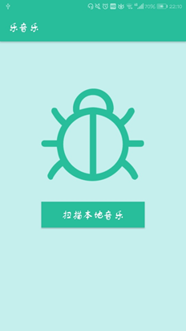

CUEB大三上学年Android课程大作业


## **移动应用开发技术**

**设 计 题 目： 乐音乐播放器**   

2018年12月


# 1.    背景

###### 1.1 选题意义

当今市场上流行的网易云音乐，QQ音乐，酷狗音乐等音乐播放器，各有其特色之处，但都有些功能繁琐，界面复杂，虽是为了满足用户更多的需求，但太多操作的同时可能会让用户不知所措。而经过这一年Android的学习，我了解到音乐播放器不仅能完美囊括安卓的四大组件、数据库、网络访问等，还能充分运用本学期所学的其他Android知识。基于以上两点，我选择开发一个简单干净、美观新颖但不失基本功能的音乐播放器APP。

###### 1.2 课题参考

本音乐(乐音乐)播放器界面主要借鉴乐趣APP及网易云音乐。

# 2.    APP概括

###### 2.1 功能简介

作为一个音乐播放器，最基本的功能当然是播放音乐。所以乐音乐第一步是获取用户手机内存里的所有音乐及其对应信息并展示在APP界面，然后根据用户点击实现对应音乐的播放、暂停、换曲等基本功能。其次还提供后台播放，用户登录、注销，收藏音乐及通知当前播放的音乐等功能，最后再根据用户输入的关键字搜索网络音乐并能听对应的在线歌曲。

###### 2.2 界面简介

乐音乐主要包括主界面，音乐列表界面，我的界面，音乐播放界面，网络搜索展示页面，登录界面等。在实现基本功能的同时，为了使乐音乐不失美观而拥有更好的用户体验，整个APP主要使用大众环保的浅绿色及白色作为默认色，当然用户也可以选择切换已提供的其他颜色。同样为了增加一些乐趣性，主界面提供大量的gif格式的动图，可随着用户的点击随机切换展示；在我的界面通过下拉刷新可获取网络高清随机图片，让用户每次都有新视觉的体验。

###### 2.3 技术简介

基于上述功能及界面概述，乐音乐主要用到以下组件及框架：

1）四大组件：活动(Activity)、服务(Service)、广播(Broadcast Receiver)、内容提供器(Content Provider)；

2）页面展示：Fragment，ListView等；

3）数据库：SQLiteDatabase及SharedPreferences；

4）其他：事件监听器，适配器，通知，SeekBar，MediaPlayer，SwipeRefreshLayout等；

5）第三方框架：OkHttp，GifImageView，GSON。

以下小节将对每个页面及各个功能实现加以阐述。

# 3.    功能及页面详解

为了能将乐音乐清晰明了的解释清楚，同时也让自己进一步的学习，本人将该项目分为两个版块讲解：功能类及活动页。

###### 3.1 功能类

##### 3.1.1 音乐实体类--Music

该类是一个音乐实体类，保存获取到的本地及网络音乐信息。

##### 3.1.2 常量类--Constants

该类全是静态变量，作为整个项目的全局变量来控制所有音乐的表现及行为。其中包括所有音乐列表，我的收藏列表，网络音乐列表，本地广播(控制音乐的动作，进度，完成等)的路径，音乐播放的模式，是否是新音乐，是否正在播放等。

##### 3.1.3 数据库辅助类--MyDataBaseHelper

该类继承自SQLiteOpenHelper类，使用SQL创建数据库，负责保存音乐播放列表及我的收藏，在APP启动时调用。其主要代码如下：

```java
public String createTableSQL="create table if not exists music_tb" +
"(_id integer primary key autoincrement,title,artist,album,album_id,time,url)";
private Context mContext;
public void onCreate(SQLiteDatabase db) {
        db.execSQL(createTableSQL);
    }
```

##### 3.1.4 音乐的获取--MusicUtils

该类相当于一个音乐获取辅助类，全是静态方法。主要功能如下：

1）使用内容提供器获取用户手机所有音乐及其对应信息。主要包括音乐名字、专辑名、大小、时长、保存路径、专辑图片Id等。其中获取音乐的主要代码如下所示：

```java
ContentResolver mResolver = getActivity().getContentResolver();
Cursor cursor = mResolver.query(MediaStore.Audio.Media.EXTERNAL_CONTENT_URI,
null,null,null, MediaStore.Audio.Media.DEFAULT_SORT_ORDER));
String url = cursor.getString(cursor.getColumnIndex(MediaStore.Audio.Media.DATA));
```

获取到上面的音乐对象后依次遍历赋值给音乐实体集合类。

2）使用SQLiteDatabase数据库查询我的收藏的音乐信息。在乐音乐关闭时保存信息，下一次打开时即赋值我的收藏。

3）因为专辑图片是一个对象，为了适配UI，故使用位图(Bitmap)类通过之前获得的音乐专辑Id并加上专辑图片路径返回对应音乐的专辑图片。

##### 3.1.5 音乐的控制--服务及广播—MusicService

该类继承自Service类，负责MediaPlayer对象的创建，音乐播放前的准备及播放、后台播放、通知等等。以下就接收前台广播控制音乐动作及进度、发送广播更新前台UI及通知加以解释。

1）接收广播：该类含有一个内部类ActivityReceiver继承自BroadcastReceiver类，通过广播过滤器策略(IntentFilter)添加控制音乐播放的动作、进度、播放模式的广播，重写其方法onReceive()，通过Intent判断接收到的广播并做出相应的操作。其大致框架如图1所示。

 

图 1 MusicService接收广播

 

2）发送广播及通知：该类发送两个广播，一是音乐结束时发送音乐完成广播，二是设置定时器每隔1秒发送音乐进度广播，音乐播放界面接收到对应广播然后更新相应的音乐信息及进度条；其次是每次播放新音乐时都向状态栏发送一条通知，主要包括该音乐的名字及作者信息。其通知代码如下所示：

```java
NotificationManager manager = (NotificationManager)getSystemService(Service.NOTIFICATION_SERVICE);
Notification.Builder builder = new Notification.Builder(this);
builder.setAutoCancel(false)
      .setTicker("乐音乐")
      .setSmallIcon(R.drawable.music)
      .setContentTitle("正在播放音乐")
      .setContentText(currentMusic.getTitle()+"  "+currentMusic.getSinger());
Intent intent = new Intent();
PendingIntent pIntent = PendingIntent.getActivity(this, 0, intent, 0);
builder.setContentIntent(pIntent);
manager.notify(0x11, builder.build());
```

最后在退出乐音乐时重置音乐播放器及取消广播接收器，关闭服务。

 

###### 3.2 活动页

##### 3.2.1 主活动--MainActivity

该活动通过碎片组件Fragment，使用FragmentPagerAdapter适配器及ViewPager视图翻页工具，动态添加了三个页面：主页面，音乐列表页面，我的页面。其布局是在主布局的基础上添加一个底部布局bottom.xml，当页面侧滑的时候改变相应布局及操作。

同时，当用户打开NavigationView导航视图时，还监听导航视图的操作，例如当用户点击登录时将登录信息保存到SharedPreferences数据库并展示在视图的相应位置，点击一键换肤时，改变乐音乐整体颜色等等。导航视图如图2所示。

此外，还监听FloatingActionButton悬浮按钮，当用户点击时通过Intent启动音乐播放界面。其次，启动乐音乐时启动服务MusicService，退出时将相关音乐信息保存到SQLiteDatabase数据库。大致框架如图3所示。

##### 3.2.2 主页面--MainFragment

MainFragment是乐音乐的主页面，是除启动页外用户的第一印象页，其重要性尤为重要。所以该页面使用了一个第三方插件--GifImageView作为全屏背景，可播放gif动态图片，其次布局选用帧布局(FrameLayout)，然后还加入了收藏按钮，下一曲按钮，可隐藏的播放、暂停按钮。其视图如图4所示。下面就每个功能加以解释。

1）GifImageView是Github上一个开源的gif播放框架，地址见技术参考。其简要用法是先在app/build.bradle dependencies里加入如下配置：

```java
compile 'pl.droidsonroids.gif:android-gif-drawable:1.1.+'
```

在布局文件里加入如下代码：

       ```xml
<pl.droidsonroids.gif.GifImageView
        android:id="@+id/music_gif"
        android:layout_width="match_parent"
        android:layout_height="match_parent"
        android:fitsSystemWindows="true"
        android:alpha="0.8"
        android:background="@drawable/g2">
</pl.droidsonroids.gif.GifImageView>
       ```


图2 导航视图                    图4主页面

 

图3 MainActivity框架

然后每次点击下一首音乐时随机选择一张gif图片设置作为主界面的背景图，代码如下：

```java
public void setRandGif() {
     int rand = new Random().nextInt(n)+1;
     String gifName = "g"+rand;
     int imgId = getResources().getIdentifier(gifName, "drawable", "xjj.com.luomusic");
     gif.setBackgroundResource(imgId);
}
```


2）收藏功能：首先在布局文件里加上一个ImageButton组件并设置相应参数，初始化，设置监听并根据用户点击作出相应操作，大致流程如图5所示。

 

图5 收藏流程

3）下一曲按钮：同样在布局文件里加一个ImageButton组件，初始化之后设置监听，当用户点击时获得当前音乐的下一首，使用Intent包含对应音乐信息，发送新音乐的广播让服务播放音乐。并判断该音乐是否为收藏后作出相应UI操作。

4）可隐藏的播放、暂停按钮：该功能同样是通过发送广播来实现。在布局文件里加上ImageButton组件，初始化之后设置监听。当用户点击页面时出现按钮，并从音乐列表或数据库(上一次退出时保存的音乐信息)获取音乐，使用Intent包含音乐信息发送播放或暂停广播，服务接收广播并作出对应操作。最后使用一个定时器在2秒之后又隐藏按钮组件。定时器代码如下：

```java
Timer timer = new Timer();
timer.schedule(new TimerTask() {
       @Override
       public void run() {
            control.setVisibility(View.INVISIBLE);
       }
    },2000);
```

##### 3.2.3 音乐列表页面--MusicListFragment

该页面负责显示用户手机内存里的所有音乐及信息，还能控制音乐的播放或暂停，效果如图6所示。下面就显示音乐及控制音乐动作加以解释。

1）音乐列表：该类继承自ListFragment。顾名思义，ListFragment是一种特殊的Fragment，继承Fragment且包含了一个ListView，可以在ListView里面显示数据。

首先创建一个线性布局文件，其中包括显示音乐专辑图片的ImageView组件，音乐名字、作者、时长的TextView组件。然后创建一个内部类MusicAdapter继承自BaseAdapter作为适配器，根据获取到的音乐列表实现getView()方法，初始化组件及赋值即可。其中当音乐专辑图片为空时设置默认图片。

2）音乐点击控制：该功能主要重写onListItemClick()方法，其实现过程大致与主页面MainFragment控制音乐动作相同，下面再用一逻辑图加以阐述。如图7所示。

 

图7 控制音乐动作

​     

图6 音乐列表视图                    图8 我的页面

##### 3.2.4 我的页面--MineFragment

该页面主要由一个下拉刷新及ListView等组件组成，负责用户一些常规操作，例如我的喜欢，扫描本地等。其视图效果如图8所示。此处ListView视图的实现是ItemAdapter继承ArrayAdapter类并作为适配器，每项item作为对象实体装入，与我的音乐列表实现大致相同，所以不再阐述。现将详细解释下拉刷新获取网络图片。

1）下拉刷新：在布局文件里加入SwipeRefreshLayout及ImageView组件，代码如下：

```xml
<android.support.v4.widget.SwipeRefreshLayout
        android:id="@+id/swipe_refresh"
        android:layout_width="match_parent"
        android:layout_height="200dp"
        android:background="@color/transparent">
        <ImageView
            android:id="@+id/bing_pic_img"
            android:layout_width="match_parent"
            android:layout_height="200dp"
            android:src="@drawable/allbg01"
            android:scaleType="centerCrop"/>
</android.support.v4.widget.SwipeRefreshLayout>
```

初始化界面之后重写setOnRefreshListener()方法实现刷新动作，代码如下：

```xml
refresh.setOnRefreshListener(new SwipeRefreshLayout.OnRefreshListener() {
            @Override
            public void onRefresh() {
                loadBingPic();
                refresh.setRefreshing(false);
            }
});
```


其中loadBingPic()方法是加载网络图片，refresh.setRefreshing(false)为请求完成后隐藏进度条。其他更多设置可详见项目。其刷新效果如图9所示。

 

图9 刷新效果

2）请求网络图片：此处请求网络使用开源且封装很好的第三方插件OkHttp。首先在app/build.gradle dependencies闭包里添加如下依赖：

```java
  compile 'com.squareup.okhttp3:okhttp:3.4.1'  
```


因为请求网络是耗时操作，如果在方法里开一个子线程可能会在服务器没来得及响应该方法就结束了，所以此处可使用回调机制，当然这一点OkHttp已经帮我们封装好了，代码如下所示：

```java
public class HttpUtil {
    public static void sendOkHttpRequest(final String address, Callback callback) {
        OkHttpClient client = new OkHttpClient();
        Request request = new Request.Builder()
                .url(address)
                .build();
        client.newCall(request).enqueue(callback);
    }
}
```


其中参数Callback就是Okhttp自带的一个回调接口，并且在enqueue()方法里开好了子线程，所以调用sendOkHttpRequest()方法就可以。因为我请求的是图片，所以使用位图(Bitmap)来解析存储，然后调用runOnUiThread()将当前线程切换到主线程绘制UI，当然请求失败或没有网络时使用默认图片。请求网络主要代码如下：

```java
byte[] bingPic = response.body().bytes();
final Bitmap bmp = BitmapFactory.decodeByteArray(bingPic, 0, bingPic.length);
getActivity().runOnUiThread(new Runnable() {
         @Override
         public void run() {
               bing_img.setImageBitmap(bmp);
         }
});
```


更多OkHttp的使用方法可参照技术参考里给出的Github地址。

最后用户圆形logo参考了开源博客，因为其用法与ImageView相同，故此处不在阐述。其博客地址见技术参考。

##### 3.2.5 音乐播放界面--MusicPlayActivity

该页面活动是音乐播放的主界面，通过悬浮按钮动态启动。布局设置了音乐播放形式，可转动的音乐专辑图片，上、下一曲，首音乐和末音乐、可拖动的进度条等，其效果如图10所示。这里主要就专辑图片转动及进度条加以解释，其他功能与之前所述大致相同，不在累述。

1）专辑图片转动：该功能主要使用ObjectAnimator.ofFloat(view,"propertyName",values)方法实现动画，参数意义依次为：操作的控件，操作控件的属性，X、Y、Z旋转度数。输入对应参数实现二维360度旋转，其主要代码如下所示：

```java
  ObjectAnimator animator  = ObjectAnimator.ofFloat(picView, "rotation", 0f, 360.0f); 
```


播放新音乐时通过start()启动动画，播放、暂停音乐时分别使用pause()，resume()方法控制相应动画。

2）音乐进度条：在布局文件添加一个SeekBar组件并初始化，然后创建一个内部类ServerReceiver继承自BroadcastReceiver广播接收器，通过广播过滤策略添加来自MusicService服务的更新进度广播及音乐完成广播，实现其方法onReceive()，当为更新进度广播时关键代码如下：

```java
  playProgress.setProgress((int)(position*1.0/currentMusic.getTime()*100));  
```

​      

图10 音乐列表视图                    图12 WebMusic

当用户拖动进度条结束时，重写onStopTrackingTouch()方法，获得拖动进度条的位置，通过Intent包含信息发送更新音乐进度广播，MusicService接收广播作出相应操作。进度条主要框架逻辑如图11所示。

 

图11 SeekBar流程

##### 3.2.6 在线音乐--WebMusicActivity

该功能主要是爬取QQ音乐API，真的花了我不少时间。由于爬取API主要是网络+浏览器+JavaScript等的操作，故在此处不再阐述。下面主要解释获取用户关键字后解析获得的JSON数据呈现在页面的过程。搜索框设置在音乐列表(MusicListFragment)，如图6所示，输入关键字周杰伦搜索后的展示结果如图12所示。

1） 获取JSON：主要还是通过OkHttp请求网络，前面已经阐述，此处省略。

2） 解析JSON：输入关键字周杰伦后的部分JSON数据如图12所示。

 

图12 JSON数据

获得数据后，通过GSON解析。首先在app/build.bradle dependencies加入如下库依赖配置：

```java
  compile  'com.google.code.gson:gson:2.7'  
```


根据JSON数据键(key)在Music实体类创建对应字段，因为是解析JSON数组，主要使用如下代码解析：

```java
Gson gson = new Gson();
webMusicList = gson.fromJson(jsonData, new TypeToken<List<Music>>(){}.getType());
```


最后从webMusicList获取相关字段绘制UI。该布局主要与音乐列表相同，且控制音乐播放、暂停主要也是通过广播传递在线音乐的url等信息，然后服务接收广播作出相应操作，前面已作描述，此处省略。

##### 3.2.7 登录及扫描页面

登录主要用到SharedPreferences保存用户信息，扫描页面主要用到ProgressBar模拟扫描。由于这两个页面逻辑实现较简单，此处不再阐述。其视图如13，14所示。

###### 3.3权限配置

为了读写手机歌曲，访问网络，在AndroidManifest里加入如下配置：

```xml
<uses-permission android:name="android.permission.READ_EXTERNAL_STORAGE" />
<uses-permission android:name="android.permission.WRITE_EXTERNAL_STORAGE" />
<uses-permission android:name="android.permission.WRITE_SETTINGS" />
<uses-permission android:name="android.permission.INTERNET" />
```


​      

图13 登录视图                    图14 扫描视图

# 4.    问题及拓展

所谓沉浸式布局，即状态栏颜色透明化后能随对应布局背景色变色。乐音乐Fragment基本运用了该功能。但其与Activity有所不同，让我走了许多弯路，故在此阐述一下。

1）首先在Actitity里让主题(theme)设为NoActionBar，并让其状态栏颜色为透明；

2）对应Fragment布局里加如下属性代码：

```xml
  android:fitsSystemWindows="true"  
```

3）删除其所有根布局的android:fitsSystemWindows="true"属性，因为嵌套布局为让该属性失效。

结论

通过本次乐音乐的开发学习，不仅巩固了我的Android的基础知识，也加强了对四大组件的认识，并且在网路，数据库，适配器，UI适配等方面有了更深一步的了解。但是本APP还有很多的不足，如加载大量网络图片会出现内存溢出等等。所以还有更多的难题及技术等着我去挑战及学习，加油。

技术参考

[1] GifImageView：https://github.com/koral--/android-gif-drawable

[2] OkHttp：https://github.com/square/okhttp/wiki/Recipes

[3] 圆形logo：https://blog.csdn.net/u011192530/article/details/53836546

 