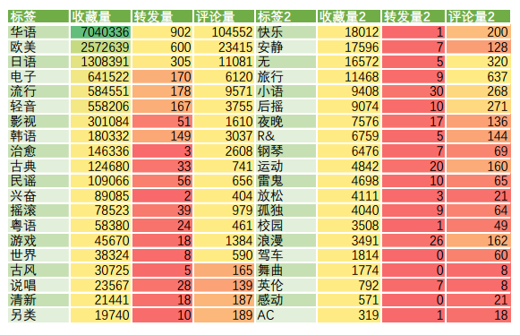
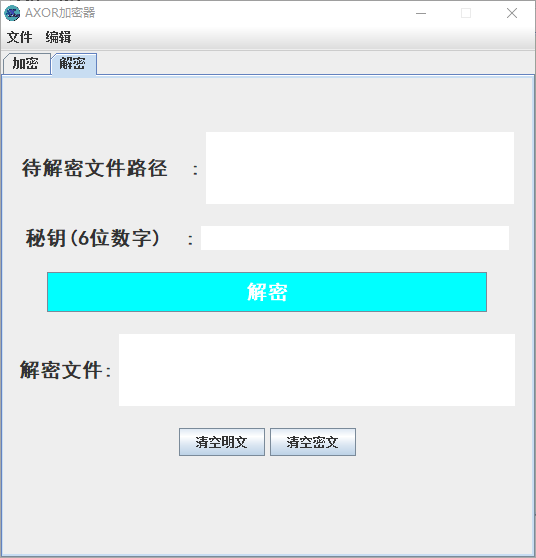
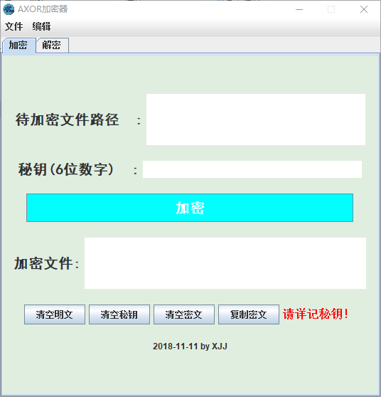
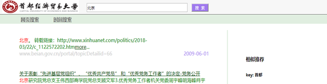

# cueb.xjj.study
大学学习课程

git remote add cueb https://github.com/LIJIEJIE519/cueb.xjj.study.git

git push -u cueb master

### 1. Python小学期实习

- 大二学年下
- 学习爬虫，使用python统计汇总

结果展示

### 2. Android移动开发课程

- 大三学年上
- Android开发音乐播放器
- 详情见Android

结果展示

### 3. 网络安全开发课程

- 大三学年上
- 加解密算法与客户端

结果展示

### 4. XML开发课程

- 大三学年上
- 方言文化xml展示

结果展示

### 4. 搜索引擎开发课程

- 大三学年上
- Java，爬取北京cueb词条信息展示

结果展示

### 继续完善！！！