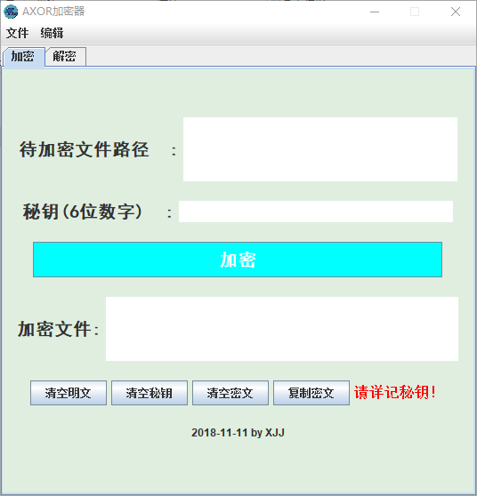
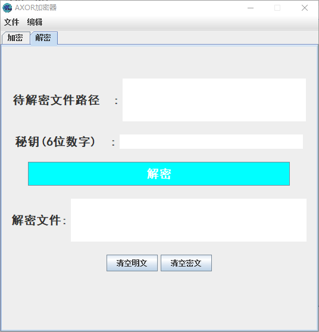

## CUEB

## 大三上学年网络安全课程大作业

### 1. launch4j打包.exe

launch4j 可以用来将Java应用程序转成Windows本地可执行文件 (.exe)。

https://blog.csdn.net/chen_zw/article/details/48792367

#### 2. 客户端程序

- 支持字符串与文件加解密

- 程序详情见-->netSecurity_JavaGUI

- 加解密算法见-->AXOR密码算法.pdf

  

