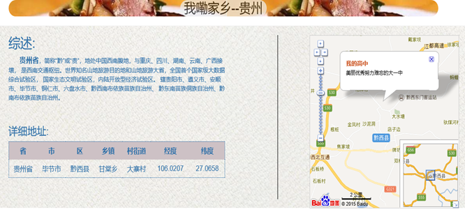
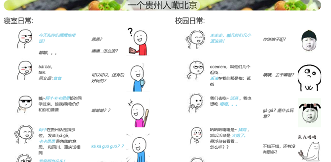
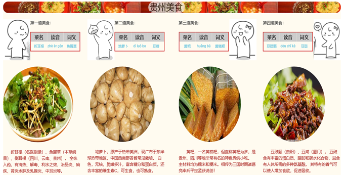
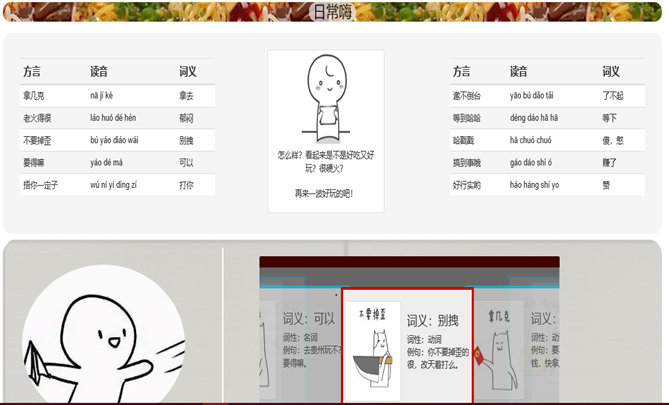

## CUEB大三学年上>>XML期末作业报告

### **西南官话之贵州方言**

2018年12月
**

#### **目录**

[**1.** **背景****.** **1**](#_Toc532478177)

[**1.1** **方言分区****.** **1**](#_Toc532478178)

[**1.2** **选题意义****.** **1**](#_Toc532478179)

[**2.** **技术方法****.** **1**](#_Toc532478180)

[**2.1** **XML** **1**](#_Toc532478181)

[**2.2** **XSL** **1**](#_Toc532478182)

[**2.3** **HTML** **2**](#_Toc532478183)

[**2.4** **CSS** **2**](#_Toc532478184)

[**2.5** **JavaScript****之JQuery****框架****.** **2**](#_Toc532478185)

[**2.6** **Bootstrap****框架****.** **2**](#_Toc532478186)

[**3.** **结果展示****.** **2**](#_Toc532478187)

[**3.1** **贵州名胜特点****.** **3**](#_Toc532478188)

[**3.2** **贵州综述****.** **3**](#_Toc532478189)

[**3.3** **我在北京的日常****.** **4**](#_Toc532478190)

[**3.4** **贵州美食****.** **5**](#_Toc532478191)

[**3.5** **日常语言****.** **7**](#_Toc532478192)

[**3.6** **结语****.** **9**](#_Toc532478193)

[**4.** **结论****.** **9**](#_Toc532478194)

 

**西南官话之贵州方言**

# 1.    背景

## 1.1 方言分区

西南官话，亦称上江官话，学术上称为西南方言，属于现代汉语方言的次方言之一，即西南方言。还有六个方言是吴方言、湘方言、赣方言、客家方言、闽方言、粤方言。

南方方言包括西南官话主要分布在四川、重庆、贵州、云南、湖北等省市，此外广西、湖南、陕西、江西等省市区及东南亚北部部分地区也有分布。西南官话下分6个片22个小片，是官话里分布范围最广，使用人口最多的方言区。

## 1.2 选题意义

中国文化不是一种简单的文化，而是由许许多多地方文化组成，方言就是地方文化的代表。每种语言都有其自身的文化特色，其文化价值都值得尊重与传承，而一种语言的文化价值其实还包括方言的存在。

贵州，追溯历史可到战国后期夜郎国；观现代，1949年11月15日中国人民解放军解放贵阳。作为一个历史悠久并且集众多少数民族的省市，其地方语言贵州话有其及独特之处。而我作为一个土生土长的贵州人，使用贵州话二十年有余更希望其得到传承及发展。

# 2.    技术方法

为了简单明了并且不失美观、准确地表达我所了解到的贵州方言日常，本作业主要使用如下技术框架存储并展示方言数据。

### 2.1 XML

主要负责存储方言数据。其中根据dtd文件包括地理位置、词条等；词条里包括词汇、读音、插图、扩展等等。

### 2.2 XSL

主要负责方言数据的排版及对应元素展示。选择XML文件里的数据，使用HTML标签通过XSL将XML转换为HTML。

### 2.3 HTML

因为XSL能将XML转换为HTML，为了更好的呈现XML数据，故在XSL选择XML特定数据之后，通过HTML的标签将数据展示在浏览器上。

### 2.4 CSS

修饰HTML网页标签，配合脚本语言动态地对HTML特定元素进行格式化。

### 2.5 JavaScript之JQuery框架

优化HTML特定元素的操作、事件监听处理、相关动画设计。例如图片的动态展示，相关板块的动态创建及隐藏等等。

### 2.6 Bootstrap框架

提供优雅的HTML和CSS规范，更好的排版网页元素。本作业运用了其导航、导航条、排版、缩略图、jQuery 插件等等。

其简要作用如表1。

| **技术框架** | **目的**                | **备注**                    |
| ------------ | ----------------------- | --------------------------- |
| XML          | 存储方言数据            | 通过dtd验证                 |
| XSL          | 转换、规范、选择XML数据 | 依据XML文件                 |
| HTML         | 显示方言数据            | XSL转换XML                  |
| CSS          | 修饰HTML标签            | 依据HTML                    |
| JQuery       | 动态展示元素等          | JavaScript、  Bootstrap框架 |

- 表1

# 3.    结果展示

现代汉语有各种不同的方言，它们分布的区域很广，而仅仅作为西南官话之一的贵州方言，其差异表现在语音、词汇、语法等各个方面，语音方面尤为突出。

为了更好的理解及展示，该作业我主要分为6个板块来实现，其中包括贵州名胜特点、贵州综述、我在北京的日常、贵州美食、日常语言及结语。XML词条主要来自具有日常对话、生活习惯等特征的语言。以下就每一板块加以阐述。

#### 3.1 贵州名胜特点

该板块主要采用Bootstrap框架，做了一个轮播图展示。其内容包括多民族欢迎、百里杜鹃、黄果树瀑布、织金洞、贵州茅台，体现了贵州是一个具有多民族文化、古址名胜等特点的省市。

#### 3.2 贵州综述

该板块主要描述贵州的地理位置、生态文明、发展状况、主要市县及方言分布，且引用了百度地图API动态展示了我的家乡的详细地址。其XML词条主要如表2所示；结果如图1所示。

 ```xml
贵州综述词条
<地理位置>
        <省>贵州省</省>
        <市>毕节市</市>
        <区>黔西县</区>
        <乡镇>甘棠乡</乡镇>
        <村街道>大寨村</村街道>
        <经度>106.0207</经度>
        <纬度>27.0658</纬度>
</地理位置>
    <方言分区>西南官话</方言分区>
 ```

- 表2

 

- 图1 贵州综述

#### 3.3 我在北京的日常

本小节主要阐述我来北京两年之间，作为一个贵州人用贵普话(贵州方言普通话)与同学之间的日常。为了简单明了且具有乐趣性、连贯性，故设计了两个小对话，以及一些小插图漫画设计，使其对方言的理解更加生动形象。其次是运用到XSL调用XML数据并将其转换为HTML元素，用JQuery选择相关元素并做了一些动态展示处理，CSS选择HTML对应元素作相应排版等。

下面表3罗列了该板块涉及的一些XML词条，图2为简要结果展示。

 ```xml
我在北京词条
<词条 class="01">
        <词汇>摆摆</词汇>
        <拼音>bai bai</拼音>
        <音调>bái bái</音调>
        <词义>聊聊</词义>
        <英语词义>talk</英语词义>
        <释义>聊天</释义>
        <词性>动词</词性>
        <例句>今天和你们摆摆贵州话！</例句>
</词条>

<词条 class="03">
        <词汇>卡卡果果</词汇>
        <拼音>ka ka guo guo</拼音>
        <音调>kā kā guō guō</音调>
        <词义>角落</词义>
        <英语词义>corner</英语词义>
        <释义>某个角落</释义>
        <词性>名词</词性>
        <例句>你自家去找个卡卡果果去蹲起。</例句>
        <拓展 类型="同义词">
            <词汇>卡卡都</词汇>
            <方言分区>西南官话</方言分区>
            <拼音>ka ka dou</拼音>
            <音调>kā kā dōu</音调>
             <词义>角落</词义>
             <英语词义>corner</英语词义>
             <释义>某个角落</释义>
             <词性>名词</词性>
             <例句>去找个卡卡都去玩。</例句>
             <备注>和四川、重庆话相同</备注>
        </拓展>
</词条>
 ```

- 表3

 

- 图2 北京日常

#### 3.4 贵州美食

该小结连接上文对话，主要展示了几个贵州特色菜、美食、方言称呼及其相关综述概况。通过XSL选择XML特定词条转换为HTML元素，并使用JQuery对相应图片描述进行特定时间的隐藏与呈现等。同样为了更好理解加入了一些小漫画。

下面表4是涉及的一些XML词条，图3为该节结果。

 ```xml
贵州美食词条
<词条 class="food01">
        <词汇>嘎嘎</词汇>
        <拼音>ga ga</拼音>
        <音调>gá gá</音调>
        <词义>猪肉</词义>
        <英语词义>Pork</英语词义>
        <释义>猪的肉</释义>
        <词性>名词</词性>
        <例句>我想吃嘎嘎！</例句>
        <插图>images/4xml/01.JPEG</插图>
</词条>

<词条 class="food05">
        <词汇>黄粑</词汇>
        <拼音>huang ba</拼音>
        <音调>huǎng bā</音调>
        <词义>黄糕粑</词义>
        <英语词义>Yellow cake</英语词义>
        <释义>黄粑，一名黄糕粑，但直称黄粑为多，是贵州、四川等地非常有名的特色传统小吃。主材料均为糯米和粳米。相传为三国时期诸葛亮率兵平定孟获说创！
        </释义>
        <词性>名词</词性>
        <例句>烩面黄粑。</例句>
        <插图>images/4xml/05.jpg</插图>
    </词条>
 ```

- 表4

 

- 图2 北京日常

#### 3.5 日常语言

该小节罗列了一些我家乡日常生活中涉及到的对话用语。通过XSL获取相应XML词条之后，使用Bootstrap框架作了一个表格并对每个词条加以描述，最终使用JQuery做了一个带漫画描述词条的3D轮播自转图。

下面表5是涉及的一些XML词条，图4为该节结果。

 ```xml
日常用语词条
<词条 class="d01">
        <词汇>拿几克</词汇>
        <拼音>na ji ke</拼音>
        <音调>nā jí kè</音调>
        <词义>拿去</词义>
        <英语词义>give</英语词义>
        <释义>给你</释义>
        <词性>动词</词性>
        <例句>要不要压岁钱，快拿几克了嘛。</例句>
        <拓展 类型="同义词">
            <方言分区>西南官话</方言分区>
            <拼音>na ke</拼音>
            <音调>nā kè</音调>
            <词义>给</词义>
        </拓展>
        <插图>images/4xml/d01.JPG</插图>
</词条> 

<词条 class="d07">
        <词汇>等到哈哈</词汇>
        <拼音>deng dao ha ha</拼音>
        <音调>déng dáo hā hā</音调>
        <词义>等下</词义>
        <英语词义>wait for me</英语词义>
        <释义>等一等</释义>
        <词性>动词</词性>
        <例句>你要不要吃饭？ 等到哈哈嘛。</例句>
        <拓展 类型="同义词">
            <词汇>等哈</词汇>
            <方言分区>西南官话</方言分区>
        </拓展>
        <插图>images/4xml/d07.JPG</插图>
    </词条>
 ```

- 表5

 

- 图4 日常用语

 

- 图5 无名之辈

#### 3.6 结语

该小节作为结语，引用了最近的(2018.12)热播电影无名之辈为题。该电影在中国的“山水桥城”——贵州都匀市拍摄，男主角也为贵州人，并且电影的对话基本都是贵州方言。其中的一个插曲—瞎子，展现了对生活的无奈。故此处还引用其为结束。使用了JQuery简单控制音乐播放。该节结果展示由图5所示。

# 4.    结论

方言是地方文化的重要组成部分，传承和保护方言有非常重要的积极意义。方言保护是社会之责，同时也可通过文化、艺术组织的努力，通过影视娱乐、大众交流等形式推动。

而在本次作业当中，我也算尽我一份绵薄之力呈现及传递我的家乡的方言。也希望更多的方言得到保护及传递。